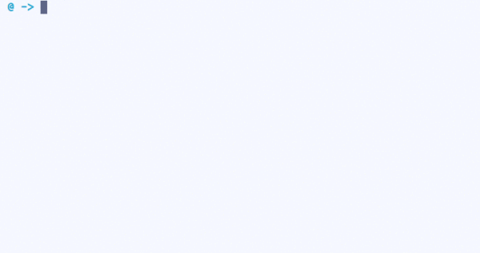

# Applied Data Science @ Columbia
## Fall 2018
## Project 1: What made you happy today?

### [Project Description](doc/)
This is the first and only *individual* (as opposed to *team*) this semester. 

Term: Fall 2018

+ Projec title: What made you happy today?
+ This project is conducted by zhibo zhou (zz2520)

+ Project summary: The  purpose of this project is to understand what behaviors make people happy. With the help of HappyDB dataset(a corpus of 100,000 happy moments),
my project describes the dataset at begining, and implement the NLP method to topiclize the dataset and use the topics to answer the source of happiness.

proj/
├── [lib](./lib)/
├── [data](./data)/
├── [doc](./doc)/
├── [figs](./figs)/
└── [output](./output)/

Please see each subfolder for a README file.
