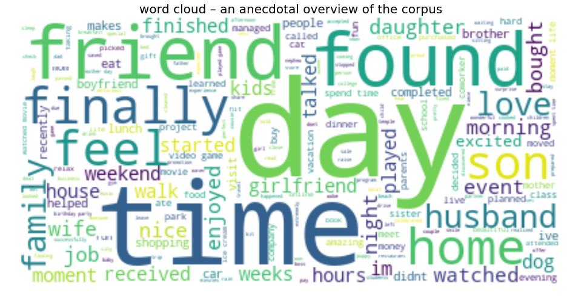

# What made you happy today?

summary:Before I did this project, I happened to read an interesting article called[A Data Scientist’s Guide to Happiness](https://medium.freecodecamp.org/a-data-scientists-guide-to-happiness-findings-from-the-happy-experiences-of-10-000-humans-fc02b5c8cbc1).In this article, the author drew a conclution with the same data that Happiness is not conditional on demographics. he uses the emotional intensity of text to weigh the happiness. 


the analysis above claim that there’s little change in the spread of happy experiences across these gender, family, and age demographic groups.In order to aviod the same work.my project follws 3 outline:
1. EDA and Wordclouds
2. NLP 
3. Topic Modelling with LDA
the purpose of this project is to understand what behaviors make people happy. With the help of HappyDB dataset(a corpus of 100,000 happy moments), my project describes the dataset at begining, and implement the NLP method to topiclize the dataset and use the topics to answer the source of happiness.


```python
import numpy as np
import pandas as pd
import plotly.offline as py
py.init_notebook_mode(connected=True)
import plotly.graph_objs as go
import plotly.tools as tls
from collections import Counter
from scipy.misc import imread
from sklearn.feature_extraction.text import TfidfVectorizer, CountVectorizer
from sklearn.decomposition import NMF, LatentDirichletAllocation
from matplotlib import pyplot as plt
```


<script>requirejs.config({paths: { 'plotly': ['https://cdn.plot.ly/plotly-latest.min']},});if(!window.Plotly) {{require(['plotly'],function(plotly) {window.Plotly=plotly;});}}</script>


## 1.EDA and Wordclouds

What are the activities described in a given happy moment?


```python
rawdata = pd.read_csv("C:\\Users\\Andrew\\Documents\\GitHub\\Fall2018-Proj1-andrewzhouxlxl\\output\\processed_moments2.csv")
all_words = rawdata['text'].str.split(expand=True).unstack().value_counts()

```


```python
data = [go.Bar(
            x = all_words.index.values[0:50],
            y = all_words.values[0:50],
            marker= dict(colorscale='Jet',
                         color = all_words.values[0:100]
                        ),
            text='cleaned WC'
    )]

layout = go.Layout(
    title='Top 20 Word frequencies for cleaned words'
)

fig = go.Figure(data=data, layout=layout)

py.iplot(fig, filename='basic-bar')
```


<div id="230dd2f1-92f1-4a9a-b934-f503d28aaa70" style="height: 525px; width: 100%;" class="plotly-graph-div"></div><script type="text/javascript">require(["plotly"], function(Plotly) { window.PLOTLYENV=window.PLOTLYENV || {};window.PLOTLYENV.BASE_URL="https://plot.ly";Plotly.newPlot("230dd2f1-92f1-4a9a-b934-f503d28aaa70", [{"marker": {"color": [10327, 9370, 9197, 4508, 4074, 3966, 3869, 3742, 3644, 3480, 3416, 3335, 3296, 3268, 3194, 3058, 3056, 3026, 2905, 2863, 2829, 2807, 2797, 2778, 2736, 2683, 2593, 2534, 2471, 2414, 2390, 2306, 2169, 2137, 2109, 2052, 1989, 1948, 1934, 1906, 1864, 1851, 1819, 1807, 1723, 1703, 1660, 1641, 1632, 1590, 1528, 1526, 1511, 1510, 1508, 1478, 1468, 1449, 1439, 1438, 1433, 1417, 1405, 1405, 1385, 1368, 1351, 1329, 1315, 1303, 1288, 1243, 1242, 1220, 1203, 1202, 1185, 1185, 1175, 1174, 1160, 1160, 1154, 1149, 1140, 1121, 1115, 1105, 1090, 1087, 1085, 1081, 1080, 1075, 1064, 1051, 1043, 1041, 1032, 993], "colorscale": "Jet"}, "text": "cleaned WC", "x": ["friend", "day", "time", "family", "watched", "home", "played", "feel", "finally", "found", "enjoyed", "moment", "son", "night", "dinner", "game", "job", "daughter", "life", "nice", "bought", "birthday", "love", "favorite", "wife", "husband", "morning", "received", "started", "dog", "event", "school", "house", "visit", "hours", "talked", "car", "finished", "surprise", "girlfriend", "walk", "movie", "im", "sister", "mother", "money", "won", "lunch", "completed", "called"], "y": [10327, 9370, 9197, 4508, 4074, 3966, 3869, 3742, 3644, 3480, 3416, 3335, 3296, 3268, 3194, 3058, 3056, 3026, 2905, 2863, 2829, 2807, 2797, 2778, 2736, 2683, 2593, 2534, 2471, 2414, 2390, 2306, 2169, 2137, 2109, 2052, 1989, 1948, 1934, 1906, 1864, 1851, 1819, 1807, 1723, 1703, 1660, 1641, 1632, 1590], "type": "bar", "uid": "80defb38-bbf3-11e8-ab49-d5d38ee5368c"}], {"title": "Top 20 Word frequencies for cleaned words"}, {"showLink": true, "linkText": "Export to plot.ly"})});</script>


First,project uses the cleaned dataset which generate by the two rmd file in doc. and it's easy to find that "friend", "day", "time" are 3 top words.


```python
from wordcloud import WordCloud
tw = rawdata[0:]['text'].values


```


```python
plt.figure(figsize=(16,13))
wc = WordCloud(background_color="white")
wc.generate(" ".join(str(v) for v in tw))
plt.title("word cloud – an anecdotal overview of the corpus", fontsize=20)
plt.imshow(wc, interpolation='bilinear')
plt.axis('off')
```


    (-0.5, 399.5, 199.5, -0.5)





Word cloud is also an intuitive overview of the corpus. The words "friend" and "day" appear most prominently in HappyDB; "wife" and "husband" occur about equally, and so do "son" and "daughter".However,"night" appears more often than "morning" (3268 vs. 2593 times), and "dog" occur much more often than "cat".

## 2.NLP

after the quick view of the dataset, the dataset still seems imperfect. For example, word "day" and "time" seems to appear too many times and may affect the analysis later. so I decide to use the lemmatization again by pacakage from nltk.


```python
# # Define helper function to print top words
def print_top_words(model, feature_names, n_top_words):
    for index, topic in enumerate(model.components_):
        message = "\nTopic #{}:".format(index)
        message += " ".join([feature_names[i] for i in topic.argsort()[:-n_top_words - 1 :-1]])
        print(message)
        print("="*70)
```


```python
from nltk.stem import WordNetLemmatizer
lemm = WordNetLemmatizer()
class LemmaCountVectorizer(CountVectorizer):
    def build_analyzer(self):
        analyzer = super(LemmaCountVectorizer, self).build_analyzer()
        return lambda doc: (lemm.lemmatize(w) for w in analyzer(doc))
```

## 3.Topic Modelling with LDA


```python
# transform datat into a list
import nltk
nltk.download('wordnet')
df = pd.read_csv("C:\\Users\\Andrew\\Documents\\GitHub\\Fall2018-Proj1-andrewzhouxlxl\\doc\\textdata.csv")
text = df['text'].values.astype('U')
# vectorizer
tf_vectorizer = LemmaCountVectorizer(max_df=0.95, 
                                     min_df=3,
                                     stop_words='english',
                                     decode_error='ignore')
tf = tf_vectorizer.fit_transform(text)
```

    [nltk_data] Downloading package wordnet to
    [nltk_data]     C:\Users\Andrew\AppData\Roaming\nltk_data...
    [nltk_data]   Package wordnet is already up-to-date!
    


```python
#lad method
lda = LatentDirichletAllocation(n_components=10, max_iter=10,
                                learning_method = 'online',
                                learning_offset = 50.,
                                random_state = 0)
```


```python
lda.fit(tf)
```


    LatentDirichletAllocation(batch_size=128, doc_topic_prior=None,
                 evaluate_every=-1, learning_decay=0.7,
                 learning_method='online', learning_offset=50.0,
                 max_doc_update_iter=100, max_iter=10, mean_change_tol=0.001,
                 n_components=10, n_jobs=1, n_topics=None, perp_tol=0.1,
                 random_state=0, topic_word_prior=None,
                 total_samples=1000000.0, verbose=0)


```python
n_top_words = 30
print("\nTopics in LDA model: ")
tf_feature_names = tf_vectorizer.get_feature_names()
print_top_words(lda, tf_feature_names, n_top_words)
```

    
    Topics in LDA model: 
    
    Topic #0:bought happiness girlfriend cat vacation moved tv summer song decided positive breakfast bos listening people wonderful music hear beach world hadnt life heard ran live pleasant feel cool emotional beat
    ======================================================================
    
    Topic #1:dinner wife night home sister friend told morning love eat cooked delicious day time couple daughter attended woke coffee father havent share meal girlfriend mail son relative uncle study boy
    ======================================================================
    
    Topic #2:watched job daughter mom party ive child class purchased ate cleaned enjoyed laugh promotion relax goal lost proud smile reached son set bit weight episode price ready week feel dream
    ======================================================================
    
    Topic #3:nice day movie money food time college spent parent family buy run make ticket expected feel finally paid saved cousin town temple gym interview missed ate cake awesome fun entire
    ======================================================================
    
    Topic #4:friend time favorite house visit talked mother day met brother book waiting read store live card week baby home managed drive drink evening finally left minute hour travel prepared recently
    ======================================================================
    
    Topic #5:family husband day surprise friend son trip gift time meet excited sleep called restaurant learned park home passed graduation exam ice bike result picked ride cream funny office student planned
    ======================================================================
    
    Topic #6:moment birthday life im day celebrated boyfriend feel hour hit mturk special dollar love accepted realized apartment wedding picture program completed looked complimented bad started happened yard perfect super road
    ======================================================================
    
    Topic #7:dog car finally finished walk time spend day completed project won dad girl started helped morning rain coworker night bed fixed feel computer extra business son test hug taking win
    ======================================================================
    
    Topic #8:received school lunch free brought date company person successfully amazing pizza coming offer planted garden raise pay city sale news check leave flower arrived niece item memory bonus unexpected return
    ======================================================================
    
    Topic #9:played game enjoyed event friend weekend kid shopping phone video started didnt fun hard time online local team weather hour won called season performance close deal concert baseball excited rest
    ======================================================================
    

with the help of sklearn and LatentDirichletAllocation, I generate 10 topics. Next step is to visualize LDA results. I'am going to use a specialized tool called PyLDAVis

Iteratively, the algorithm goes through each word and reassigns the word to a topic taking into consideration:
What’s the probability of the word belonging to a topic
What’s the probability of the document to be generated by a topic


```python
import pyLDAvis
import pyLDAvis.sklearn
pyLDAvis.enable_notebook()
panel = pyLDAvis.sklearn.prepare(lda, tf, tf_vectorizer, mds='tsne')
panel
```

    C:\Users\Andrew\Anaconda3\lib\site-packages\pyLDAvis\_prepare.py:257: FutureWarning:
    
    Sorting because non-concatenation axis is not aligned. A future version
    of pandas will change to not sort by default.
    
    To accept the future behavior, pass 'sort=True'.
    
    To retain the current behavior and silence the warning, pass sort=False
    
    
    


<link rel="stylesheet" type="text/css" href="https://cdn.rawgit.com/bmabey/pyLDAvis/files/ldavis.v1.0.0.css">


<div id="ldavis_el957618260165497684476231560"></div>
<script type="text/javascript">

var ldavis_el957618260165497684476231560_data = {"mdsDat": {"x": [15.39897346496582, 200.05360412597656, 54.274208068847656, -145.85658264160156, -223.7436981201172, 1.7113265991210938, -82.34807586669922, 159.8303680419922, -88.39855194091797, 79.07600402832031], "y": [-73.87245178222656, 54.926231384277344, 61.42408752441406, -119.12118530273438, 45.75000762939453, -216.50352478027344, 27.336809158325195, -107.16385650634766, 178.54476928710938, 204.334716796875], "topics": [1, 2, 3, 4, 5, 6, 7, 8, 9, 10], "cluster": [1, 1, 1, 1, 1, 1, 1, 1, 1, 1], "Freq": [11.918961126118015, 11.200743343034336, 10.65749617767931, 10.083242860090744, 9.815777028872677, 9.575790347763427, 9.248140066325576, 9.215738467352983, 9.155631378442303, 9.12847920432063]}, "tinfo": {"Category": ["Default", "Default", "Default", "Default", "Default", "Default", "Default", "Default", "Default", "Default", "Default", "Default", "Default", "Default", "Default", "Default", "Default", "Default", "Default", "Default", "Default", "Default", "Default", "Default", "Default", "Default", "Default", "Default", "Default", "Default", "Topic1", "Topic1", "Topic1", "Topic1", "Topic1", "Topic1", "Topic1", "Topic1", "Topic1", "Topic1", "Topic1", "Topic1", "Topic1", "Topic1", "Topic1", "Topic1", "Topic1", "Topic1", "Topic1", "Topic1", "Topic1", "Topic1", "Topic1", "Topic1", "Topic1", "Topic1", "Topic1", "Topic1", "Topic1", "Topic1", "Topic1", "Topic1", "Topic1", "Topic1", "Topic1", "Topic1", "Topic1", "Topic1", "Topic1", "Topic1", "Topic2", "Topic2", "Topic2", "Topic2", "Topic2", "Topic2", "Topic2", "Topic2", "Topic2", "Topic2", "Topic2", "Topic2", "Topic2", "Topic2", "Topic2", "Topic2", "Topic2", "Topic2", "Topic2", "Topic2", "Topic2", "Topic2", "Topic2", "Topic2", "Topic2", "Topic2", "Topic2", "Topic2", "Topic2", "Topic2", "Topic2", "Topic2", "Topic2", "Topic2", "Topic2", "Topic2", "Topic2", "Topic2", "Topic2", "Topic2", "Topic2", "Topic2", "Topic3", "Topic3", "Topic3", "Topic3", "Topic3", "Topic3", "Topic3", "Topic3", "Topic3", "Topic3", "Topic3", "Topic3", "Topic3", "Topic3", "Topic3", "Topic3", "Topic3", "Topic3", "Topic3", "Topic3", "Topic3", "Topic3", "Topic3", "Topic3", "Topic3", "Topic3", "Topic3", "Topic3", "Topic3", "Topic3", "Topic3", "Topic3", "Topic3", "Topic3", "Topic3", "Topic3", "Topic3", "Topic3", "Topic3", "Topic3", "Topic3", "Topic4", "Topic4", "Topic4", "Topic4", "Topic4", "Topic4", "Topic4", "Topic4", "Topic4", "Topic4", "Topic4", "Topic4", "Topic4", "Topic4", "Topic4", "Topic4", "Topic4", "Topic4", "Topic4", "Topic4", "Topic4", "Topic4", "Topic4", "Topic4", "Topic4", "Topic4", "Topic4", "Topic4", "Topic4", "Topic4", "Topic4", "Topic4", "Topic4", "Topic4", "Topic4", "Topic4", "Topic4", "Topic4", "Topic4", "Topic4", "Topic4", "Topic4", "Topic5", "Topic5", "Topic5", "Topic5", "Topic5", "Topic5", "Topic5", "Topic5", "Topic5", "Topic5", "Topic5", "Topic5", "Topic5", "Topic5", "Topic5", "Topic5", "Topic5", "Topic5", "Topic5", "Topic5", "Topic5", "Topic5", "Topic5", "Topic5", "Topic5", "Topic5", "Topic5", "Topic5", "Topic5", "Topic5", "Topic5", "Topic5", "Topic5", "Topic5", "Topic5", "Topic5", "Topic5", "Topic5", "Topic5", "Topic5", "Topic5", "Topic5", "Topic6", "Topic6", "Topic6", "Topic6", "Topic6", "Topic6", "Topic6", "Topic6", "Topic6", "Topic6", "Topic6", "Topic6", "Topic6", "Topic6", "Topic6", "Topic6", "Topic6", "Topic6", "Topic6", "Topic6", "Topic6", "Topic6", "Topic6", "Topic6", "Topic6", "Topic6", "Topic6", "Topic6", "Topic6", "Topic6", "Topic6", "Topic6", "Topic6", "Topic6", "Topic6", "Topic6", "Topic6", "Topic6", "Topic7", "Topic7", "Topic7", "Topic7", "Topic7", "Topic7", "Topic7", "Topic7", "Topic7", "Topic7", "Topic7", "Topic7", "Topic7", "Topic7", "Topic7", "Topic7", "Topic7", "Topic7", "Topic7", "Topic7", "Topic7", "Topic7", "Topic7", "Topic7", "Topic7", "Topic7", "Topic7", "Topic7", "Topic7", "Topic7", "Topic7", "Topic7", "Topic7", "Topic7", "Topic7", "Topic7", "Topic7", "Topic8", "Topic8", "Topic8", "Topic8", "Topic8", "Topic8", "Topic8", "Topic8", "Topic8", "Topic8", "Topic8", "Topic8", "Topic8", "Topic8", "Topic8", "Topic8", "Topic8", "Topic8", "Topic8", "Topic8", "Topic8", "Topic8", "Topic8", "Topic8", "Topic8", "Topic8", "Topic8", "Topic8", "Topic8", "Topic8", "Topic8", "Topic8", "Topic8", "Topic8", "Topic8", "Topic8", "Topic8", "Topic8", "Topic8", "Topic8", "Topic8", "Topic9", "Topic9", "Topic9", "Topic9", "Topic9", "Topic9", "Topic9", "Topic9", "Topic9", "Topic9", "Topic9", "Topic9", "Topic9", "Topic9", "Topic9", "Topic9", "Topic9", "Topic9", "Topic9", "Topic9", "Topic9", "Topic9", "Topic9", "Topic9", "Topic9", "Topic9", "Topic9", "Topic9", "Topic9", "Topic9", "Topic9", "Topic9", "Topic9", "Topic9", "Topic10", "Topic10", "Topic10", "Topic10", "Topic10", "Topic10", "Topic10", "Topic10", "Topic10", "Topic10", "Topic10", "Topic10", "Topic10", "Topic10", "Topic10", "Topic10", "Topic10", "Topic10", "Topic10", "Topic10", "Topic10", "Topic10", "Topic10", "Topic10", "Topic10", "Topic10", "Topic10", "Topic10", "Topic10", "Topic10", "Topic10", "Topic10", "Topic10", "Topic10", "Topic10"], "Freq": [3960.0, 9964.0, 3830.0, 2974.0, 2958.0, 3028.0, 4365.0, 3080.0, 2810.0, 2844.0, 3402.0, 3409.0, 2509.0, 2630.0, 2688.0, 3267.0, 2331.0, 2379.0, 2388.0, 2494.0, 2919.0, 2981.0, 9488.0, 3854.0, 2122.0, 1955.0, 2040.0, 1928.0, 1986.0, 1821.0, 2493.8840357180284, 1954.4056385586925, 1415.0909816954556, 1302.8618211695352, 1109.141172972117, 1061.3641460635824, 968.7732277934648, 951.5445487698278, 898.9764442860017, 829.8715747055403, 804.0491595876107, 762.5281484186008, 645.1238606365755, 630.6620181432554, 591.6374655986085, 582.2295373231362, 579.7020614532316, 567.4482099976984, 566.8672511833867, 541.6674636251828, 532.6391709978902, 528.0535101327291, 457.06492303896755, 432.0522811399192, 396.96870791216355, 396.7090649207239, 366.7050216637371, 361.48449450894674, 334.0131937000506, 310.2779993140534, 3323.7198062348675, 1100.4736418480693, 1027.4112133647102, 1664.765661732954, 549.3047436009068, 1966.2835856760041, 1698.217139318663, 1252.0773075899024, 891.6390947448941, 532.6546659280161, 2687.4379304594695, 2121.1935404194874, 2040.0524476557819, 1985.7804599394951, 1734.3133821372505, 1226.1276068347483, 949.4711816858737, 938.7373697598523, 897.1107315971437, 787.7446240833627, 680.8569584645306, 656.1257362449606, 646.1780601995796, 610.7823492316983, 581.8037043676105, 581.2518075830449, 471.83790269202797, 440.51268771320207, 422.43622163431485, 420.9393861299051, 414.51358731244864, 407.9895537665395, 404.8223478018889, 395.67815159495007, 375.5882148239805, 367.719617263271, 358.51351368925725, 335.418634293315, 293.41181639801016, 286.1777007381108, 1094.8370163095037, 1110.5342850748855, 4555.742536769813, 887.3716806085556, 2985.866179008851, 754.6815665405294, 757.7150389984375, 1598.8336022371698, 691.8452720919959, 558.1535982824124, 591.5284974148216, 435.16112036640925, 3079.7410421212508, 2630.0468002244693, 1774.8443583985636, 1396.619588583209, 1095.132882379847, 1016.6338365393594, 828.0602937993358, 754.1604231330548, 748.3456239466842, 739.8739125156712, 736.7970824958697, 675.3320191201774, 661.5142115840835, 648.3230787128471, 574.8251647590062, 481.3250940095477, 444.2503684599833, 441.86805633080667, 409.6892401202796, 397.9145382475915, 396.271232322804, 388.88087322015485, 377.068722176723, 369.9569973754329, 362.4947398079611, 350.17756221168673, 327.79973728098, 321.9062197903947, 301.25621164270376, 300.87306539027406, 2612.025736179175, 1157.4614222723712, 2269.8715548771615, 1357.6255449107894, 1312.6801169174687, 1546.482066049962, 760.9348227616725, 610.1753290120811, 871.580565899148, 847.208937161657, 555.9081000233773, 2387.248543843299, 1954.792251233055, 1927.478600684896, 1759.0709892937052, 1428.8368215167584, 1029.8287411241288, 939.6320360819124, 917.2817826038615, 713.4874257603105, 676.4386453639056, 648.8084602482515, 617.4437060916398, 565.2439006013442, 556.5062355743637, 527.3313898160435, 493.8276215279971, 487.7320991861505, 448.58705011227016, 426.12020415571544, 412.864309894145, 394.0672566753888, 373.22456995472277, 371.9397248945518, 358.5409573262549, 346.24585429891545, 333.5462208645254, 326.4638338229269, 310.4416747785589, 293.58674346354246, 292.9367568275584, 1197.8569456065206, 845.7083405035826, 1933.5229946053826, 1027.14064860499, 885.9123239603289, 1533.3325780783102, 775.160012711532, 1229.8767148465065, 454.49273742704383, 654.7994004036901, 583.6989714809521, 497.54914254714015, 3829.682174474329, 3027.1640474615024, 2378.950204156166, 1407.860289002502, 1324.2129921065516, 1248.0638880746553, 1224.500103097824, 1181.3560182965161, 1135.6191971928076, 928.4173079877515, 741.412800235168, 722.2211151763952, 666.0009341894638, 487.10721623200146, 450.4133743363668, 400.4247637714191, 384.31050383030237, 356.1175467377462, 342.6193414437716, 319.5337233488553, 301.7726493591383, 293.42332731203703, 267.1615403468071, 264.48184510463994, 246.6504278685489, 244.3215282852068, 232.46953090135918, 231.99925256806515, 226.32547191036946, 225.90203277124843, 2548.2843292616167, 1085.5433394448921, 673.75631509655, 1163.796555291592, 425.36662124792, 2163.9168330961547, 319.9944765842267, 558.1161614434653, 516.7519770234336, 563.7304189610479, 852.6202735763751, 343.4279255859402, 2843.233498132379, 1819.3776195161593, 1663.9057957688299, 1488.0747525143238, 1211.4180214254602, 1168.9161681607704, 1149.191033124112, 1037.3785496317078, 952.0563245322954, 720.3741214447598, 702.212718402971, 654.9683279813805, 643.8734365387073, 596.878194456499, 592.3989977882796, 583.8222752876005, 503.096981639921, 497.3459586221017, 424.97592969044143, 388.59802153804003, 387.77886677081733, 369.96627130462247, 331.034815064704, 328.0765260351699, 318.93497010575754, 317.58342698461854, 315.39962249145276, 302.81918630323906, 300.210679322305, 295.00300042696836, 842.8504256411476, 2173.7974957991432, 1041.1900557427539, 1368.8299247783577, 670.9912072654017, 656.2990867526232, 396.8491421197118, 379.68904623298477, 3959.3402044834097, 2973.973181253125, 1401.8626807087783, 1231.0712984283516, 1190.3035993786634, 1162.5594297769671, 1124.7293912785042, 1124.4536797617657, 923.4044085834328, 844.2557859842791, 840.9731019027089, 772.8403135555137, 647.4269607228739, 632.1389837721609, 624.016861346051, 497.23225224139503, 448.9252704245967, 404.39314160775695, 384.62565372431766, 378.39178812021237, 374.233606555341, 373.5570817250563, 366.66351448188414, 358.0949649424366, 355.7489409791125, 337.5142381261821, 318.4274444502603, 314.82896658802434, 313.93809880869225, 303.3761762782374, 2158.070607764133, 1047.5280685128137, 527.9720541463076, 860.3573866435661, 484.0472558342948, 370.5568805856185, 369.67328615656623, 2809.52995291492, 1820.201298144788, 1468.8750705627167, 1116.2496406629364, 845.4022114518916, 647.3311689755111, 566.7671455544935, 565.0536083227942, 531.7612799353677, 501.89675966890485, 457.937243039077, 448.32531385042194, 434.7596128808114, 413.5404134561148, 401.71456724447467, 390.7488382913613, 367.2916800175663, 355.3204448652917, 344.3480071680188, 334.81912225866625, 333.23482277154096, 324.8899921734533, 322.3811218867774, 305.1419228491913, 299.9673372256218, 292.50334896916763, 277.9367277839329, 273.39413390077834, 263.69659894267784, 260.48599994152596, 2865.673839655292, 2296.1437292087153, 978.2157747152602, 453.97957054045116, 1105.4740385725138, 1648.1617913151276, 367.4823205066042, 559.2016290659516, 358.7800525586362, 421.2293681754948, 381.4316769226514, 2508.5803441243056, 2330.970276047664, 1676.761859422296, 1137.8203367674137, 854.667454475214, 822.373614861456, 783.7696346989204, 766.258962147497, 696.2216962974796, 674.1507688215337, 630.6306123433991, 599.9932461727534, 552.4878407519135, 527.3746459773836, 527.297695085896, 513.0295010346937, 506.61557636161996, 503.89012752097767, 498.16405798377616, 483.6954351882332, 469.7840250948201, 456.2929283929525, 442.94221573832033, 432.7735840121639, 431.57875513292004, 372.6633269833924, 340.11758457279296, 311.3361615104063, 306.9892235304932, 294.4276908902963, 779.3749875573307, 513.3055227393694, 399.3003826871277, 364.41627617934773, 2957.3309527812557, 1484.0993168438126, 1108.6124710365202, 1097.993487880912, 1076.4249052927807, 777.3392104652957, 764.2166664233229, 764.1623066484894, 753.6944496013444, 723.5023669035626, 681.3727292252411, 680.4759043019142, 658.9212478370533, 571.4014230199368, 571.155243402842, 560.5555473562887, 553.7458803547577, 504.5488192937903, 429.73247089815214, 528.2892191950951, 399.5109451011408, 372.8653587569013, 356.0642329987165, 351.02301842703673, 334.0318610405624, 311.7945752533124, 303.5486314610555, 300.4012419389374, 288.6422984054402, 278.1349080113453, 1315.5795665833625, 637.9757848061639, 397.6836994411033, 459.27729381177215, 372.5591659947535], "Term": ["watched", "friend", "played", "job", "bought", "game", "family", "dinner", "birthday", "nice", "moment", "enjoyed", "received", "wife", "favorite", "night", "school", "event", "dog", "husband", "daughter", "life", "day", "home", "house", "car", "visit", "finished", "talked", "im", "husband", "surprise", "trip", "gift", "meet", "sleep", "restaurant", "learned", "park", "passed", "graduation", "exam", "ice", "bike", "result", "picked", "ride", "cream", "funny", "student", "marriage", "afternoon", "puppy", "hand", "grade", "dance", "sweet", "hold", "award", "productive", "family", "excited", "called", "son", "office", "day", "friend", "time", "home", "planned", "favorite", "house", "visit", "talked", "mother", "met", "waiting", "read", "store", "card", "managed", "drive", "drink", "evening", "left", "minute", "travel", "prepared", "movement", "water", "neighbor", "grocery", "birth", "chicken", "hang", "half", "text", "hike", "short", "task", "book", "brother", "friend", "live", "time", "baby", "week", "day", "home", "hour", "finally", "recently", "dinner", "wife", "sister", "told", "cooked", "delicious", "couple", "attended", "woke", "coffee", "father", "havent", "share", "meal", "mail", "relative", "uncle", "study", "boy", "tonight", "invited", "function", "married", "finding", "doctor", "treat", "born", "issue", "forward", "heart", "night", "eat", "home", "morning", "love", "friend", "daughter", "girlfriend", "day", "time", "son", "dog", "car", "finished", "walk", "spend", "project", "dad", "girl", "rain", "coworker", "bed", "fixed", "computer", "extra", "business", "test", "hug", "win", "conversation", "match", "nephew", "earlier", "kiss", "hot", "warm", "quality", "workout", "god", "spring", "sun", "completed", "helped", "finally", "won", "started", "time", "morning", "day", "taking", "night", "feel", "son", "played", "game", "event", "weekend", "kid", "shopping", "phone", "video", "didnt", "hard", "online", "local", "weather", "season", "performance", "deal", "concert", "baseball", "rest", "childhood", "appreciated", "basketball", "level", "mall", "progress", "board", "friday", "customer", "soccer", "spouse", "enjoyed", "fun", "team", "started", "close", "friend", "chat", "won", "called", "hour", "time", "excited", "nice", "movie", "money", "food", "college", "spent", "parent", "buy", "run", "ticket", "expected", "paid", "saved", "cousin", "town", "temple", "gym", "interview", "missed", "cake", "awesome", "entire", "released", "degree", "dish", "partner", "mile", "dress", "discussion", "colleague", "make", "day", "family", "time", "feel", "finally", "ate", "fun", "watched", "job", "mom", "party", "ive", "child", "class", "purchased", "cleaned", "laugh", "promotion", "relax", "goal", "lost", "proud", "reached", "set", "bit", "weight", "episode", "price", "ready", "dream", "exercise", "clothes", "chocolate", "beer", "pound", "church", "accomplished", "daughter", "ate", "smile", "enjoyed", "son", "week", "feel", "birthday", "im", "celebrated", "boyfriend", "hit", "mturk", "special", "dollar", "accepted", "realized", "apartment", "picture", "program", "looked", "complimented", "bad", "yard", "super", "road", "forget", "amazon", "earned", "anniversary", "account", "approved", "sunday", "photo", "step", "animal", "package", "moment", "life", "hour", "wedding", "feel", "day", "happened", "love", "perfect", "completed", "started", "received", "school", "lunch", "free", "brought", "date", "company", "successfully", "amazing", "pizza", "coming", "offer", "planted", "garden", "raise", "city", "sale", "news", "check", "leave", "flower", "arrived", "niece", "item", "memory", "unexpected", "email", "caught", "discovered", "teacher", "person", "pay", "bonus", "return", "bought", "happiness", "cat", "vacation", "moved", "tv", "summer", "song", "decided", "positive", "breakfast", "bos", "listening", "wonderful", "music", "hear", "beach", "hadnt", "heard", "world", "ran", "pleasant", "cool", "emotional", "beat", "band", "pair", "research", "id", "holiday", "girlfriend", "people", "live", "life", "feel"], "Total": [3960.0, 9964.0, 3830.0, 2974.0, 2958.0, 3028.0, 4365.0, 3080.0, 2810.0, 2844.0, 3402.0, 3409.0, 2509.0, 2630.0, 2688.0, 3267.0, 2331.0, 2379.0, 2388.0, 2494.0, 2919.0, 2981.0, 9488.0, 3854.0, 2122.0, 1955.0, 2040.0, 1928.0, 1986.0, 1821.0, 2494.7800769455766, 1955.3017095179632, 1415.9870224822193, 1303.7578558333041, 1110.037208561634, 1062.2601755365006, 969.669286175266, 952.4406007201572, 899.8724847080044, 830.767606114491, 804.9452003731805, 763.4241552000839, 646.0198606411182, 631.5580022876879, 592.5335147073192, 583.1255982287703, 580.5980572471976, 568.3441947291519, 567.7633290945997, 542.5635076784099, 533.5351893835845, 528.9495848292111, 457.960936274198, 432.948375423719, 397.8647351411885, 397.60516482986213, 367.60110963145706, 362.38058543949836, 334.9092403528439, 311.1740818173537, 4365.705644326494, 1444.6982277310176, 1544.9598494275847, 3202.871182597087, 747.3503175394686, 9488.9356608563, 9964.961050239559, 9089.56617269922, 3854.057708159742, 1197.2009204142769, 2688.333867648692, 2122.0894533677933, 2040.9483344783198, 1986.6763687506398, 1735.2092994612801, 1227.0234886771836, 950.3671251548834, 939.6332557714479, 898.0066406846513, 788.640539547903, 681.7528979594283, 657.0216591118665, 647.0976299827532, 611.678300373397, 582.699661253093, 582.1477596682782, 472.7338168259577, 441.4086315631567, 423.33212203374103, 421.8353514706787, 415.4094970678879, 408.8854340090279, 405.7182474565874, 396.5740897008019, 376.48409498763925, 368.6155575542051, 359.4093946577515, 336.31451253153483, 294.3077543306644, 287.073653203325, 1323.2667621502942, 1543.5942548953947, 9964.961050239559, 1285.851099772643, 9089.56617269922, 1156.7654651481398, 1377.2589031914908, 9488.9356608563, 3854.057708159742, 2100.7952634493668, 3613.093269031835, 1037.0382275264951, 3080.6372125235735, 2630.9429930750803, 1775.7405605244053, 1397.5158322196125, 1096.0290854743935, 1017.5300087336877, 828.956569402751, 755.0566847275896, 749.2418126325086, 740.7701069312474, 737.6933410462351, 676.2282662604085, 662.4105021793433, 649.2192618314466, 575.7213997128742, 482.2214762743614, 445.14658630233373, 442.7643336224414, 410.5854461949783, 398.8107391783667, 397.1674629219922, 389.7770903825256, 377.9649060802721, 370.8532403072955, 363.3909271135159, 351.07382648415387, 328.69592481732934, 322.80248009458086, 302.152547319484, 301.76932720111193, 3267.6228637546346, 1482.4945586051692, 3854.057708159742, 2478.868315666988, 2708.3774926231886, 9964.961050239559, 2919.802126068344, 1926.5483854104104, 9488.9356608563, 9089.56617269922, 3202.871182597087, 2388.143195257209, 1955.686919637997, 1928.3732712636634, 1759.965651835225, 1429.7315304786025, 1030.7233818988962, 940.5267661155043, 918.1764766990948, 714.3820883511501, 677.3333250582527, 649.7031351281086, 618.3383540208278, 566.138565372788, 557.4009764967414, 528.2260754806529, 494.72229881360335, 488.626782758274, 449.4817154644512, 427.0149144665685, 413.75897158911283, 394.96192769835085, 374.11928049108445, 372.83439465541045, 359.43563619916125, 347.1405327775437, 334.44112322546243, 327.3584718131665, 311.33645469464784, 294.48139576657036, 293.8314091081236, 1619.8799938169313, 1102.2951545541346, 3613.093269031835, 1586.0520054930641, 2431.835725865458, 9089.56617269922, 2478.868315666988, 9488.9356608563, 685.1894934080883, 3267.6228637546346, 3601.19117213186, 3202.871182597087, 3830.5758988840303, 3028.0577465302035, 2379.843996814965, 1408.7540561224632, 1325.1068188722395, 1248.9576473509608, 1225.3938975957576, 1182.249725933237, 1136.5130565272414, 929.3111389541773, 742.3065716694094, 723.1149313508196, 666.8946972680044, 488.000981778336, 451.30714549260057, 401.3185396012179, 385.20423877710215, 357.0112459490254, 343.5131569867486, 320.4276858654494, 302.666441700865, 294.3170252514165, 268.05533952598387, 265.3756022584138, 247.5441972906969, 245.2153236956165, 233.36327825764963, 232.8930239006739, 227.2191640374724, 226.79580809843227, 3409.436019022488, 1466.0265618406866, 900.2266760092247, 2431.835725865458, 612.4293752567007, 9964.961050239559, 393.57075582138805, 1586.0520054930641, 1544.9598494275847, 2100.7952634493668, 9089.56617269922, 1444.6982277310176, 2844.134296338233, 1820.27048651753, 1664.7986881327895, 1488.9676653530944, 1212.3109451465004, 1169.809089879002, 1150.0839586362376, 1038.2714484848918, 952.9492339338243, 721.2670424456555, 703.10564884122, 655.8612163838349, 644.7663338073284, 597.771109363118, 593.2919331768007, 584.7151336459208, 503.9898551559709, 498.23886695491643, 425.8689154365188, 389.4909305628395, 388.6717885598011, 370.85920798019464, 331.9278167627262, 328.96946452273716, 319.82787302659017, 318.47632684645464, 316.2925093629315, 303.71208468562094, 301.10362195965877, 295.89587115256165, 1179.889275304666, 9488.9356608563, 4365.705644326494, 9089.56617269922, 3601.19117213186, 3613.093269031835, 1445.170592186071, 1466.0265618406866, 3960.2338635695064, 2974.8668306712975, 1402.756357489566, 1231.964974683064, 1191.197305011362, 1163.4531232105583, 1125.623084905176, 1125.3473645187266, 924.2980659666221, 845.1494825736016, 841.8667279855274, 773.7339954824979, 648.3206071532092, 633.0326325575996, 624.9158238944003, 498.1259911689084, 449.81897782270937, 405.2868682749588, 385.5192610626772, 379.2853989336567, 375.1273326107186, 374.45077854619, 367.55721895861643, 358.98862605495793, 356.6425961806372, 338.40789897787613, 319.3211231322827, 315.72255456081956, 314.8317883008862, 304.26984115565665, 2919.802126068344, 1445.170592186071, 757.8908462503181, 3409.436019022488, 3202.871182597087, 1377.2589031914908, 3601.19117213186, 2810.422072692206, 1821.0934681227588, 1469.7671804254535, 1117.1417740604343, 846.2943373587738, 648.2232553220676, 567.6593194553772, 565.9457306738227, 532.6534091642916, 502.7889273438273, 458.8293725755898, 449.21744963226564, 435.65183147899063, 414.4326092578717, 402.6066952171437, 391.64103296476975, 368.1838145983319, 356.2126161712317, 345.2401852899614, 335.71125943606194, 334.12694901630954, 325.7821247765234, 323.27323163174106, 306.03408107960024, 300.85945393635245, 293.39552292770685, 278.8288597318431, 274.28627003420894, 264.5887732515027, 261.37816518822143, 3402.2752539774892, 2981.510284213687, 2100.7952634493668, 682.2671613724672, 3601.19117213186, 9488.9356608563, 511.8851993466342, 2708.3774926231886, 498.6382147006889, 1619.8799938169313, 2431.835725865458, 2509.4733863596616, 2331.863340713417, 1677.6549163938816, 1138.713391156735, 855.5605161418231, 823.2666701491764, 784.6626912402855, 767.1520498665132, 697.1147930824415, 675.043782636751, 631.5237168325909, 600.8862833891025, 553.3808375947881, 528.267657687623, 528.1907030079387, 513.9225938454272, 507.50864421867595, 504.78318067696233, 499.05712073953043, 484.58851424444833, 470.6770601469162, 457.18601972504314, 443.83527022443917, 433.6666801970431, 432.4719012298855, 373.5563818671207, 341.010617802616, 312.22921827530917, 307.8822928896008, 295.32072864646705, 1101.275079704666, 840.4773363835405, 577.5746003854389, 493.96449924118156, 2958.2214220363353, 1484.98975944219, 1109.5029084009568, 1098.8839395301359, 1077.3153917239483, 778.2296901502725, 765.1071504315985, 765.0527421060957, 754.5849990313773, 724.3928382240799, 682.263187337707, 681.3663717692536, 659.8116790890153, 572.2919678950706, 572.0456986279785, 561.4460887435908, 554.6363464161589, 505.43930136602336, 430.62296795588304, 529.458919180314, 400.4014407420769, 373.7558480864143, 356.95474844081355, 351.9134877945125, 334.9223494654386, 312.68503298869484, 304.4390890744327, 301.2916621971907, 289.5328126357481, 279.0253997513466, 1926.5483854104104, 1265.379983640149, 1285.851099772643, 2981.510284213687, 3601.19117213186], "loglift": [30.0, 29.0, 28.0, 27.0, 26.0, 25.0, 24.0, 23.0, 22.0, 21.0, 20.0, 19.0, 18.0, 17.0, 16.0, 15.0, 14.0, 13.0, 12.0, 11.0, 10.0, 9.0, 8.0, 7.0, 6.0, 5.0, 4.0, 3.0, 2.0, 1.0, 2.1267, 2.1266, 2.1264, 2.1264, 2.1262, 2.1262, 2.1261, 2.1261, 2.126, 2.126, 2.1259, 2.1259, 2.1257, 2.1256, 2.1255, 2.1255, 2.1255, 2.1255, 2.1255, 2.1254, 2.1254, 2.1253, 2.1251, 2.125, 2.1248, 2.1248, 2.1246, 2.1246, 2.1244, 2.1242, 1.8543, 1.8549, 1.7191, 1.4727, 1.8192, 0.5531, 0.3575, 0.1447, 0.6632, 1.3172, 2.1889, 2.1888, 2.1888, 2.1887, 2.1887, 2.1885, 2.1882, 2.1882, 2.1882, 2.1881, 2.1879, 2.1878, 2.1878, 2.1877, 2.1877, 2.1876, 2.1873, 2.1872, 2.1871, 2.1871, 2.187, 2.187, 2.187, 2.1869, 2.1868, 2.1868, 2.1867, 2.1865, 2.1861, 2.1861, 1.9997, 1.8599, 1.4065, 1.8183, 1.076, 1.7621, 1.5916, 0.4083, 0.4717, 0.8638, 0.3796, 1.3208, 2.2386, 2.2386, 2.2384, 2.2383, 2.2381, 2.238, 2.2378, 2.2377, 2.2377, 2.2377, 2.2377, 2.2376, 2.2376, 2.2375, 2.2373, 2.237, 2.2369, 2.2369, 2.2367, 2.2367, 2.2366, 2.2366, 2.2365, 2.2365, 2.2364, 2.2364, 2.2362, 2.2361, 2.2359, 2.2359, 2.015, 1.9914, 1.7095, 1.6368, 1.5146, 0.3758, 0.8942, 1.0892, -0.1487, -0.134, 0.4877, 2.2939, 2.2938, 2.2938, 2.2938, 2.2937, 2.2934, 2.2933, 2.2933, 2.293, 2.293, 2.2929, 2.2928, 2.2927, 2.2927, 2.2926, 2.2925, 2.2925, 2.2923, 2.2922, 2.2921, 2.292, 2.2919, 2.2919, 2.2918, 2.2917, 2.2916, 2.2916, 2.2914, 2.2913, 2.2912, 1.9925, 2.0293, 1.6691, 1.8598, 1.2845, 0.5146, 1.1318, 0.2511, 1.8838, 0.6868, 0.4747, 0.4322, 2.3209, 2.3209, 2.3208, 2.3205, 2.3205, 2.3205, 2.3204, 2.3204, 2.3204, 2.3202, 2.32, 2.3199, 2.3198, 2.3193, 2.3192, 2.3189, 2.3189, 2.3187, 2.3186, 2.3184, 2.3182, 2.3181, 2.3178, 2.3178, 2.3176, 2.3175, 2.3173, 2.3173, 2.3172, 2.3172, 2.0301, 2.0207, 2.0314, 1.5842, 1.9567, 0.794, 2.1142, 1.2767, 1.226, 1.0057, -0.0454, 0.8845, 2.3456, 2.3454, 2.3454, 2.3453, 2.3452, 2.3452, 2.3452, 2.3451, 2.345, 2.3447, 2.3447, 2.3446, 2.3445, 2.3444, 2.3444, 2.3444, 2.3442, 2.3441, 2.3438, 2.3436, 2.3436, 2.3435, 2.3432, 2.3432, 2.3431, 2.3431, 2.3431, 2.343, 2.343, 2.3429, 2.0095, 0.8723, 0.9125, 0.4528, 0.6657, 0.6402, 1.0535, 0.995, 2.3805, 2.3804, 2.3801, 2.38, 2.38, 2.38, 2.38, 2.38, 2.3798, 2.3797, 2.3797, 2.3796, 2.3794, 2.3793, 2.3793, 2.379, 2.3788, 2.3785, 2.3784, 2.3784, 2.3784, 2.3784, 2.3783, 2.3783, 2.3782, 2.3781, 2.3779, 2.3779, 2.3779, 2.3778, 2.0784, 2.059, 2.0193, 1.0038, 0.4911, 1.0679, 0.1043, 2.3839, 2.3838, 2.3837, 2.3835, 2.3832, 2.3829, 2.3827, 2.3827, 2.3826, 2.3825, 2.3823, 2.3823, 2.3822, 2.3821, 2.382, 2.382, 2.3818, 2.3817, 2.3817, 2.3816, 2.3816, 2.3815, 2.3815, 2.3813, 2.3813, 2.3812, 2.3811, 2.381, 2.3809, 2.3808, 2.2126, 2.1231, 1.6199, 1.9769, 1.2033, 0.6338, 2.0528, 0.8067, 2.0551, 1.0373, 0.5318, 2.3904, 2.3904, 2.3903, 2.39, 2.3898, 2.3897, 2.3897, 2.3896, 2.3895, 2.3895, 2.3894, 2.3893, 2.3892, 2.3891, 2.3891, 2.3891, 2.389, 2.389, 2.389, 2.389, 2.3889, 2.3888, 2.3888, 2.3887, 2.3887, 2.3884, 2.3882, 2.3879, 2.3879, 2.3878, 2.0451, 1.8977, 2.0217, 2.0866, 2.3935, 2.3932, 2.393, 2.393, 2.3929, 2.3926, 2.3926, 2.3926, 2.3926, 2.3925, 2.3925, 2.3925, 2.3924, 2.3922, 2.3922, 2.3922, 2.3922, 2.392, 2.3917, 2.3916, 2.3915, 2.3914, 2.3913, 2.3912, 2.3911, 2.3909, 2.3908, 2.3908, 2.3907, 2.3906, 2.0123, 1.7089, 1.2203, 0.5232, 0.1251], "logprob": [30.0, 29.0, 28.0, 27.0, 26.0, 25.0, 24.0, 23.0, 22.0, 21.0, 20.0, 19.0, 18.0, 17.0, 16.0, 15.0, 14.0, 13.0, 12.0, 11.0, 10.0, 9.0, 8.0, 7.0, 6.0, 5.0, 4.0, 3.0, 2.0, 1.0, -3.2906, -3.5343, -3.8572, -3.9398, -4.1008, -4.1448, -4.2361, -4.2541, -4.3109, -4.3909, -4.4225, -4.4755, -4.6427, -4.6654, -4.7293, -4.7453, -4.7496, -4.771, -4.772, -4.8175, -4.8343, -4.843, -4.9873, -5.0436, -5.1283, -5.1289, -5.2076, -5.2219, -5.301, -5.3747, -3.0033, -4.1087, -4.1774, -3.6947, -4.8035, -3.5282, -3.6748, -3.9796, -4.3191, -4.8343, -3.1537, -3.3903, -3.4293, -3.4562, -3.5916, -3.9384, -4.1941, -4.2055, -4.2508, -4.3808, -4.5266, -4.5636, -4.5789, -4.6353, -4.6839, -4.6848, -4.8934, -4.9621, -5.004, -5.0075, -5.0229, -5.0388, -5.0465, -5.0694, -5.1215, -5.1427, -5.168, -5.2346, -5.3684, -5.3934, -4.0516, -4.0374, -2.6259, -4.2617, -3.0484, -4.4237, -4.4197, -3.673, -4.5106, -4.7254, -4.6673, -4.9743, -2.9677, -3.1255, -3.5188, -3.7585, -4.0017, -4.076, -4.2812, -4.3747, -4.3824, -4.3938, -4.398, -4.4851, -4.5057, -4.5259, -4.6462, -4.8237, -4.9039, -4.9093, -4.9849, -5.014, -5.0182, -5.037, -5.0679, -5.0869, -5.1073, -5.1418, -5.2079, -5.226, -5.2923, -5.2936, -3.1324, -3.9463, -3.2728, -3.7868, -3.8205, -3.6565, -4.3657, -4.5865, -4.23, -4.2583, -4.6797, -3.167, -3.3669, -3.3809, -3.4724, -3.6803, -4.0077, -4.0994, -4.1235, -4.3747, -4.4281, -4.4698, -4.5193, -4.6076, -4.6232, -4.6771, -4.7427, -4.7551, -4.8388, -4.8902, -4.9218, -4.9684, -5.0227, -5.0262, -5.0628, -5.0977, -5.1351, -5.1566, -5.2069, -5.2627, -5.2649, -3.8566, -4.2047, -3.3778, -4.0104, -4.1583, -3.6097, -4.2918, -3.8302, -4.8257, -4.4606, -4.5755, -4.7352, -2.6675, -2.9026, -3.1436, -3.6682, -3.7294, -3.7887, -3.8077, -3.8436, -3.8831, -4.0845, -4.3095, -4.3357, -4.4167, -4.7295, -4.8078, -4.9255, -4.9666, -5.0427, -5.0814, -5.1511, -5.2083, -5.2364, -5.3302, -5.3402, -5.41, -5.4195, -5.4692, -5.4713, -5.496, -5.4979, -3.0748, -3.9282, -4.4051, -3.8586, -4.8651, -3.2383, -5.1497, -4.5934, -4.6704, -4.5834, -4.1697, -5.079, -2.9406, -3.387, -3.4763, -3.588, -3.7937, -3.8294, -3.8464, -3.9488, -4.0346, -4.3135, -4.339, -4.4087, -4.4258, -4.5015, -4.5091, -4.5237, -4.6725, -4.684, -4.8412, -4.9307, -4.9328, -4.9798, -5.091, -5.1, -5.1283, -5.1325, -5.1394, -5.1801, -5.1888, -5.2063, -4.1565, -3.209, -3.9451, -3.6715, -4.3845, -4.4066, -4.9097, -4.9539, -2.5746, -2.8608, -3.6129, -3.7428, -3.7765, -3.8001, -3.8331, -3.8334, -4.0304, -4.12, -4.1239, -4.2084, -4.3854, -4.4093, -4.4223, -4.6494, -4.7516, -4.8561, -4.9062, -4.9225, -4.9336, -4.9354, -4.954, -4.9776, -4.9842, -5.0368, -5.095, -5.1064, -5.1092, -5.1435, -3.1815, -3.9043, -4.5894, -4.1011, -4.6763, -4.9434, -4.9458, -2.9142, -3.3482, -3.5627, -3.8372, -4.1151, -4.3821, -4.515, -4.518, -4.5787, -4.6365, -4.7282, -4.7494, -4.7801, -4.8302, -4.8592, -4.8869, -4.9488, -4.9819, -5.0133, -5.0413, -5.0461, -5.0714, -5.0792, -5.1342, -5.1513, -5.1765, -5.2275, -5.244, -5.2801, -5.2924, -2.8944, -3.1159, -3.9692, -4.7369, -3.8469, -3.4475, -4.9483, -4.5284, -4.9722, -4.8118, -4.911, -3.0209, -3.0943, -3.4238, -3.8115, -4.0977, -4.1362, -4.1843, -4.2069, -4.3027, -4.3349, -4.4017, -4.4515, -4.534, -4.5805, -4.5806, -4.6081, -4.6206, -4.626, -4.6375, -4.6669, -4.6961, -4.7253, -4.7549, -4.7782, -4.7809, -4.9277, -5.0191, -5.1075, -5.1216, -5.1634, -4.1899, -4.6075, -4.8587, -4.9501, -2.8534, -3.5429, -3.8346, -3.8442, -3.864, -4.1895, -4.2066, -4.2066, -4.2204, -4.2613, -4.3213, -4.3226, -4.3548, -4.4973, -4.4978, -4.5165, -4.5287, -4.6218, -4.7823, -4.5758, -4.8552, -4.9242, -4.9703, -4.9846, -5.0342, -5.1031, -5.1299, -5.1403, -5.1802, -5.2173, -3.6634, -4.3871, -4.8598, -4.7158, -4.925]}, "token.table": {"Topic": [8, 7, 8, 1, 9, 8, 8, 8, 8, 5, 8, 9, 6, 7, 3, 1, 6, 2, 3, 8, 10, 5, 5, 10, 10, 4, 7, 1, 2, 8, 7, 5, 8, 9, 2, 10, 3, 10, 10, 3, 8, 10, 1, 2, 9, 4, 6, 6, 1, 5, 4, 2, 10, 9, 8, 5, 9, 9, 2, 7, 5, 7, 7, 9, 7, 7, 1, 3, 5, 7, 3, 6, 6, 9, 9, 4, 8, 8, 4, 5, 4, 3, 10, 3, 6, 4, 1, 5, 4, 1, 9, 3, 7, 1, 2, 3, 4, 6, 8, 5, 10, 6, 3, 5, 3, 9, 6, 6, 3, 4, 8, 7, 6, 2, 2, 4, 8, 3, 9, 9, 10, 5, 7, 6, 7, 2, 5, 1, 1, 5, 7, 6, 4, 1, 6, 3, 2, 1, 2, 4, 6, 7, 8, 10, 1, 2, 4, 6, 3, 4, 4, 9, 6, 8, 3, 9, 5, 1, 2, 3, 5, 5, 6, 3, 1, 5, 9, 1, 4, 3, 10, 7, 4, 1, 1, 2, 6, 10, 2, 1, 2, 5, 8, 10, 5, 3, 10, 10, 3, 1, 4, 2, 8, 1, 10, 1, 2, 3, 4, 2, 5, 8, 2, 4, 1, 1, 10, 8, 6, 3, 3, 9, 7, 7, 5, 4, 7, 1, 9, 2, 5, 2, 8, 10, 10, 2, 10, 5, 8, 7, 1, 3, 6, 8, 10, 9, 3, 6, 8, 5, 2, 1, 3, 4, 3, 1, 9, 2, 6, 2, 6, 7, 1, 2, 7, 8, 6, 3, 4, 7, 2, 10, 2, 6, 8, 10, 2, 4, 9, 6, 9, 3, 4, 9, 1, 4, 6, 5, 8, 6, 10, 6, 1, 6, 7, 1, 6, 8, 9, 1, 2, 9, 10, 5, 8, 5, 9, 10, 5, 8, 1, 8, 9, 1, 5, 6, 8, 10, 9, 5, 10, 10, 7, 2, 7, 1, 8, 5, 4, 7, 7, 1, 7, 4, 4, 9, 10, 7, 2, 7, 8, 9, 2, 4, 5, 7, 3, 7, 6, 10, 5, 1, 1, 3, 9, 1, 8, 6, 9, 6, 9, 5, 7, 3, 5, 2, 3, 1, 6, 7, 5, 1, 3, 4, 7, 10, 8, 4, 6, 5, 4, 4, 5, 8, 8, 2, 1, 3, 9, 10, 4, 8, 8, 1, 1, 1, 4, 2, 2, 9, 4, 5, 6, 4, 2, 6, 1, 2, 3, 4, 5, 6, 8, 3, 3, 6, 2, 3, 1, 10, 3, 9, 10, 5, 2, 2, 4, 4, 7, 2, 5, 3, 8, 2, 6, 7, 5, 7, 3, 4, 3, 4, 5, 10, 4, 10, 8], "Freq": [0.998773293941145, 0.9958265953969226, 0.9966210264034898, 0.9982047725219074, 0.998400847186857, 0.9966271831122052, 0.997774761021538, 0.9960614381051152, 0.9981924161242464, 0.9977980984706469, 0.997143337445084, 0.9974058267884998, 0.27470805325443876, 0.7251739038051683, 0.9986005226508644, 0.9972851141644048, 0.9982715787984243, 0.6526820023135043, 0.34665626877843075, 0.9983632129659218, 0.997809191626004, 0.9971674675223822, 0.9955251475843389, 0.9988526781191484, 0.9972460796751524, 0.998917759373333, 0.9958627129977385, 0.9991164670771858, 0.9982296890487672, 0.9998498187527394, 0.9968247965189788, 0.9950438509416929, 0.30645391934112187, 0.6908198520740545, 0.8274975472221767, 0.17230085914763132, 0.997882770169067, 0.9979946592231934, 0.9995871093261522, 0.9985741184924993, 0.9989779506174187, 0.9981485336433933, 0.279866291695466, 0.7197487270223674, 0.9993448550613921, 0.9976788811882541, 0.9987754180404872, 0.9987395584227595, 0.6647421940321029, 0.3346365280570567, 0.9996487578706492, 0.9991877927702395, 0.9995467263788596, 0.996063090180672, 0.9994780258835066, 0.8130685404512722, 0.18548126079044647, 0.9978817640394271, 0.9985523771832017, 0.9996105359111437, 0.9986652655675047, 0.998794652905242, 0.9973579913725508, 0.9982047999903568, 0.9994464533345738, 0.9985956197308878, 0.02939114406857978, 0.27431734464007795, 0.6939575682859115, 0.9981982068672701, 0.9989603968572144, 0.9969723431791323, 0.9989186395192183, 0.9991707091616169, 0.9991554444378666, 0.739560957955377, 0.2598957957422485, 0.9984930821460472, 0.99798889275095, 0.9968737655096288, 0.9976232341490078, 0.9990610783162309, 0.9973252955872308, 0.998846056068486, 0.9987100257087709, 0.9980315082560893, 0.9976348931833596, 0.9961655188905324, 0.9994399243759112, 0.998477975430422, 0.9984614096560633, 0.2606341002377184, 0.7390911804375772, 0.20718867429042978, 0.1685120499442509, 0.0918965025337003, 0.1296246538032699, 0.22910894094984455, 0.17367595891690146, 0.9967144812135316, 0.9992247407089616, 0.9970530258054691, 0.9994791222576842, 0.9995485696144935, 0.9997931556104747, 0.9971343175298581, 0.9963347436590895, 0.9974115044484527, 0.9961723669752454, 0.9995213037227084, 0.9983289375242804, 0.9984839939746112, 0.9976553956147052, 0.9983037644832937, 0.9984450145627657, 0.9970082255861947, 0.9975992397463185, 0.7804413131125307, 0.21855054922079514, 0.9970364037075203, 0.9974042262482252, 0.7473376786611563, 0.25224113173021756, 0.997683196313571, 0.9966109981104715, 0.9988910831510895, 0.9996453562434787, 0.9994444042709486, 0.7614046856883142, 0.23741982471917433, 0.9972460797273098, 0.9984274783696557, 0.9992806318724781, 0.7613889416295725, 0.23844942486052498, 0.9990601229431572, 0.9995038311034415, 0.12912394198854094, 0.009163634592735162, 0.1621685637017374, 0.1863272367189483, 0.10274378179733364, 0.30684291590825313, 0.10357683948758228, 0.11928836813988221, 0.16384852421997742, 0.5352754152726965, 0.1815618781897047, 0.997699250769419, 0.9992878602477395, 0.9978355636325567, 0.9985615187051928, 0.9993501098945188, 0.9978813357727211, 0.9961855449185893, 0.9993735112256734, 0.9941581286146295, 0.17039705337926833, 0.45720198774790727, 0.1551436069047991, 0.2171609090181017, 0.740777846914629, 0.2592040348320065, 0.998006321044259, 0.998655550551641, 0.9996506848221717, 0.9976003496160035, 0.9994187142728128, 0.9987186812895443, 0.3166284348835871, 0.6830869185357387, 0.9979630338159264, 0.9957073620050096, 0.9978265599717411, 0.9988257581103133, 0.9978345180938669, 0.998035962141213, 0.9991308523796307, 0.99833008254375, 0.9978094953635271, 0.9987141688212482, 0.2813130760252501, 0.7169576312587971, 0.9993334907288777, 0.9985891281195093, 0.9981836514063499, 0.9992054646874661, 0.9985533331887981, 0.9974506116700217, 0.23224269737768102, 0.7674895389903053, 0.9960914189469847, 0.9984705825129194, 0.9961902334314517, 0.9963250666345774, 0.23144438084346106, 0.1795510219099496, 0.5889896238953549, 0.9987879994210705, 0.26561369863515444, 0.2684697599108013, 0.465537987930432, 0.9994866128918061, 0.9987172566457864, 0.9996873163479276, 0.9984213168924775, 0.9981597504238029, 0.9993995540910451, 0.9975135080037252, 0.9970605272813562, 0.9975140212852586, 0.9984626898318769, 0.9989948726324976, 0.9997086153025876, 0.9991647323397057, 0.9977620233879397, 0.9986399061973021, 0.9995373982169343, 0.9987855381893112, 0.9987992763689129, 0.996062978906333, 0.07546510947532727, 0.7700795171348951, 0.1539488233296676, 0.9987698321888815, 0.689815484978653, 0.3095226189644914, 0.9984581547102936, 0.998956140882238, 0.9983687530397484, 0.14768989961313758, 0.48479209548012414, 0.045045419382006964, 0.2063966347093598, 0.11630579594534585, 0.9996096238937567, 0.998746963873092, 0.7144738219459823, 0.28477248419199297, 0.9948163951519768, 0.9988956439177863, 0.9989968995593285, 0.9974471013981727, 0.9981656673541172, 0.9981219567823557, 0.9990656091943277, 0.9989088279988978, 0.9991658768665569, 0.995913563158562, 0.9980284049037099, 0.9979596645704273, 0.9994608062294441, 0.14901792540367884, 0.007935865849900057, 0.0005878419148074117, 0.8423774639190209, 0.9995202494220575, 0.5478306336069343, 0.3126426664546201, 0.13917641280883086, 0.9993030815005108, 0.9987790096251726, 0.9968532460344816, 0.9993020342158266, 0.9981129104640656, 0.9981720015892322, 0.9990142327732555, 0.9975645052576169, 0.9984484810371217, 0.9996011804577254, 0.9981180625324869, 0.7993578539840132, 0.20045152923412274, 0.99852503973946, 0.7345952588974535, 0.09634036182261685, 0.1672575726087098, 0.9982398489798211, 0.9947273132504049, 0.998686892345025, 0.9985577112460571, 0.9990574960827008, 0.9990304351751709, 0.9985043571333191, 0.9992167190602864, 0.999076027870079, 0.23677021543051938, 0.1511046098476179, 0.6103674397781731, 0.17307054231251345, 0.2125843647582928, 0.10905814995035094, 0.5041963744081442, 0.2787592204168221, 0.7199608642420082, 0.9971036454759123, 0.7073618702140323, 0.2914803085220852, 0.9996785543027997, 0.9970273531490239, 0.9980697156286926, 0.9972898434082152, 0.998453755647265, 0.44520513717577315, 0.12028056238895184, 0.15202126635270302, 0.09522211189125354, 0.18710309704948064, 0.9975047245929408, 0.9998496573624353, 0.9979776956259436, 0.9994577000166884, 0.9977114255843247, 0.9990742556127423, 0.9969948001312704, 0.9962269292786319, 0.9985037788621759, 0.997801615644184, 0.9992981803735126, 0.998970468891672, 0.9985344843907248, 0.9979017068966278, 0.9988027123346906, 0.9986810138023455, 0.998065337340218, 0.9977456948765703, 0.9989974043516605, 0.9977395454385624, 0.9993260607076662, 0.9987961607452382, 0.9984308975378692, 0.9998113602789196, 0.41946380418159296, 0.17839265235309126, 0.19092835224817334, 0.2111783290017675, 0.9974669807661855, 0.999051359398988, 0.9972047634579857, 0.9957129175504853, 0.9985061504157514, 0.9993097789268897, 0.9990996041673984, 0.2611523706626028, 0.7368950614045535, 0.9989699289556131, 0.9964077609073237, 0.9990038987387546, 0.9989977624529746, 0.9988114549920695, 0.9996297635893393, 0.9979488119579426, 0.9981793168739267, 0.9993802903516886, 0.9992332427340576, 0.9955565073926149, 0.9995829568007465, 0.9988136846645276, 0.30215432886276783, 0.6966702429674297, 0.9946344136832078, 0.5198460709399852, 0.17359424350908817, 0.15548549148835597, 0.1511144134143861, 0.9986239613974879, 0.9988385296730269, 0.9994883441660144, 0.9993083573328314, 0.9964910810957895, 0.9983652761312231, 0.3643338201574798, 0.47865075244165517, 0.15667176690744897, 0.9953104833353543, 0.998879027571685, 0.9989613977526408, 0.9982737235942468, 0.9984982770146887, 0.9985529472166429, 0.9971704552939143, 0.9986519121908881, 0.9965958079074639, 0.9993342666701375, 0.9983647774293726, 0.33567356506883206, 0.6625904284402163, 0.9996595475935192, 0.9962600078713437, 0.9955278159697076, 0.25104788163118613, 0.7487003195549534, 0.9987769537595826, 0.9985399913944945, 0.9988609238828013, 0.9982433102150914, 0.13774034714224523, 0.32850852760922067, 0.09318376519926655, 0.16865491387305268, 0.09384386270953289, 0.15061224859243907, 0.027394046676053566, 0.9996308934698841, 0.9979671079569297, 0.9978224325925299, 0.9984477166645603, 0.9969413086275677, 0.9993029438359617, 0.9984198878996314, 0.9974242500389411, 0.9985105812826974, 0.9991956024668867, 0.9989429255885423, 0.9995353461612432, 0.9985614768033347, 0.9994513234765587, 0.9967144926338102, 0.9996884366903539, 0.9980197215151212, 0.998658412982335, 0.3327142398930071, 0.6654284797860142, 0.5503685605106664, 0.1800678139929357, 0.26937564109427076, 0.9994647354382505, 0.9986530865896406, 0.9996415760137858, 0.9989282868515498, 0.9983425743043551, 0.6475197512081146, 0.35181696316857636, 0.9977424671888677, 0.9958502011399241, 0.9972445092008789, 0.9967847185253829], "Term": ["accepted", "accomplished", "account", "afternoon", "amazing", "amazon", "animal", "anniversary", "apartment", "appreciated", "approved", "arrived", "ate", "ate", "attended", "award", "awesome", "baby", "baby", "bad", "band", "baseball", "basketball", "beach", "beat", "bed", "beer", "bike", "birth", "birthday", "bit", "board", "bonus", "bonus", "book", "book", "born", "bos", "bought", "boy", "boyfriend", "breakfast", "brother", "brother", "brought", "business", "buy", "cake", "called", "called", "car", "card", "cat", "caught", "celebrated", "chat", "chat", "check", "chicken", "child", "childhood", "chocolate", "church", "city", "class", "cleaned", "close", "close", "close", "clothes", "coffee", "colleague", "college", "coming", "company", "completed", "completed", "complimented", "computer", "concert", "conversation", "cooked", "cool", "couple", "cousin", "coworker", "cream", "customer", "dad", "dance", "date", "daughter", "daughter", "day", "day", "day", "day", "day", "day", "deal", "decided", "degree", "delicious", "didnt", "dinner", "discovered", "discussion", "dish", "doctor", "dog", "dollar", "dream", "dress", "drink", "drive", "earlier", "earned", "eat", "eat", "email", "emotional", "enjoyed", "enjoyed", "entire", "episode", "evening", "event", "exam", "excited", "excited", "exercise", "expected", "extra", "family", "family", "father", "favorite", "feel", "feel", "feel", "feel", "feel", "feel", "feel", "finally", "finally", "finally", "finally", "finding", "finished", "fixed", "flower", "food", "forget", "forward", "free", "friday", "friend", "friend", "friend", "friend", "fun", "fun", "function", "funny", "game", "garden", "gift", "girl", "girlfriend", "girlfriend", "goal", "god", "grade", "graduation", "grocery", "gym", "hadnt", "half", "hand", "hang", "happened", "happened", "happiness", "hard", "havent", "hear", "heard", "heart", "helped", "helped", "hike", "hit", "hold", "holiday", "home", "home", "home", "hot", "hour", "hour", "hour", "house", "hug", "husband", "ice", "id", "im", "interview", "invited", "issue", "item", "ive", "job", "kid", "kiss", "laugh", "learned", "leave", "left", "level", "life", "life", "life", "listening", "live", "live", "local", "looked", "lost", "love", "love", "love", "love", "love", "lunch", "mail", "make", "make", "mall", "managed", "marriage", "married", "match", "meal", "meet", "memory", "met", "mile", "minute", "missed", "mom", "moment", "moment", "moment", "moment", "money", "morning", "morning", "morning", "mother", "moved", "movement", "movie", "mturk", "music", "neighbor", "nephew", "news", "nice", "niece", "night", "night", "offer", "office", "office", "office", "online", "package", "paid", "pair", "parent", "park", "partner", "party", "passed", "pay", "pay", "pay", "people", "people", "people", "people", "perfect", "perfect", "performance", "person", "person", "phone", "photo", "picked", "picture", "pizza", "planned", "planned", "planned", "planned", "planned", "planted", "played", "pleasant", "positive", "pound", "prepared", "price", "productive", "program", "progress", "project", "promotion", "proud", "puppy", "purchased", "quality", "rain", "raise", "ran", "reached", "read", "ready", "realized", "received", "recently", "recently", "recently", "recently", "relative", "relax", "released", "research", "rest", "restaurant", "result", "return", "return", "ride", "road", "run", "sale", "saved", "school", "season", "set", "share", "shopping", "short", "sister", "sleep", "smile", "smile", "soccer", "son", "son", "son", "son", "song", "special", "spend", "spent", "spouse", "spring", "started", "started", "started", "step", "store", "student", "study", "successfully", "summer", "sun", "sunday", "super", "surprise", "sweet", "taking", "taking", "talked", "task", "teacher", "team", "team", "temple", "test", "text", "ticket", "time", "time", "time", "time", "time", "time", "time", "told", "tonight", "town", "travel", "treat", "trip", "tv", "uncle", "unexpected", "vacation", "video", "visit", "waiting", "walk", "warm", "watched", "water", "weather", "wedding", "wedding", "week", "week", "week", "weekend", "weight", "wife", "win", "woke", "won", "won", "wonderful", "workout", "world", "yard"]}, "R": 30, "lambda.step": 0.01, "plot.opts": {"xlab": "PC1", "ylab": "PC2"}, "topic.order": [6, 5, 2, 8, 10, 4, 3, 7, 9, 1]};

function LDAvis_load_lib(url, callback){
  var s = document.createElement('script');
  s.src = url;
  s.async = true;
  s.onreadystatechange = s.onload = callback;
  s.onerror = function(){console.warn("failed to load library " + url);};
  document.getElementsByTagName("head")[0].appendChild(s);
}

if(typeof(LDAvis) !== "undefined"){
   // already loaded: just create the visualization
   !function(LDAvis){
       new LDAvis("#" + "ldavis_el957618260165497684476231560", ldavis_el957618260165497684476231560_data);
   }(LDAvis);
}else if(typeof define === "function" && define.amd){
   // require.js is available: use it to load d3/LDAvis
   require.config({paths: {d3: "https://cdnjs.cloudflare.com/ajax/libs/d3/3.5.5/d3.min"}});
   require(["d3"], function(d3){
      window.d3 = d3;
      LDAvis_load_lib("https://cdn.rawgit.com/bmabey/pyLDAvis/files/ldavis.v1.0.0.js", function(){
        new LDAvis("#" + "ldavis_el957618260165497684476231560", ldavis_el957618260165497684476231560_data);
      });
    });
}else{
    // require.js not available: dynamically load d3 & LDAvis
    LDAvis_load_lib("https://cdnjs.cloudflare.com/ajax/libs/d3/3.5.5/d3.min.js", function(){
         LDAvis_load_lib("https://cdn.rawgit.com/bmabey/pyLDAvis/files/ldavis.v1.0.0.js", function(){
                 new LDAvis("#" + "ldavis_el957618260165497684476231560", ldavis_el957618260165497684476231560_data);
            })
         });
}
</script>


from the visualization above, there are the main things should be considered:
1. 10 topics are distrubuted evenly in this project,which indicate the freedom will of people. it means that everyone has their perference and seems distrubute diversely.
2. more actually happiness is determined by specific things. in topic 1, the high frequence words("famliy" "husband" " song") indicate a experiences that involve their loved ones. also in topic 5 words like play game enjoy seem to show that lots of people reflect very positively on entertainments.


#### conclusion: so what acctually make people happy?
These 10 topics represent the foundations of daily happiness for thousands of people.
1. From the analysis above, it seems that famliy means a lot for large portion of people and makes them happy. 
2. Time beats money. A happier people prefer to have more time in their lives than more money.
3. Money is also important.
4. Entertainment also helps a lot.

 References
Akari Asai, Sara Evensen, Behzad Golshan, Alon Halevy, Vivian Li. HappyDB: A Corpus of 100,000 Crowdsourced Happy Moments
Jordan Rohrlich. [A Data Scientist’s Guide to Happiness: Findings From the Happy Experiences of 10,000+ Humans](https://medium.freecodecamp.org/a-data-scientists-guide-to-happiness-findings-from-the-happy-experiences-of-10-000-humans-fc02b5c8cbc1)
[Complete Guide to Topic Modeling](https://nlpforhackers.io/topic-modeling/)

